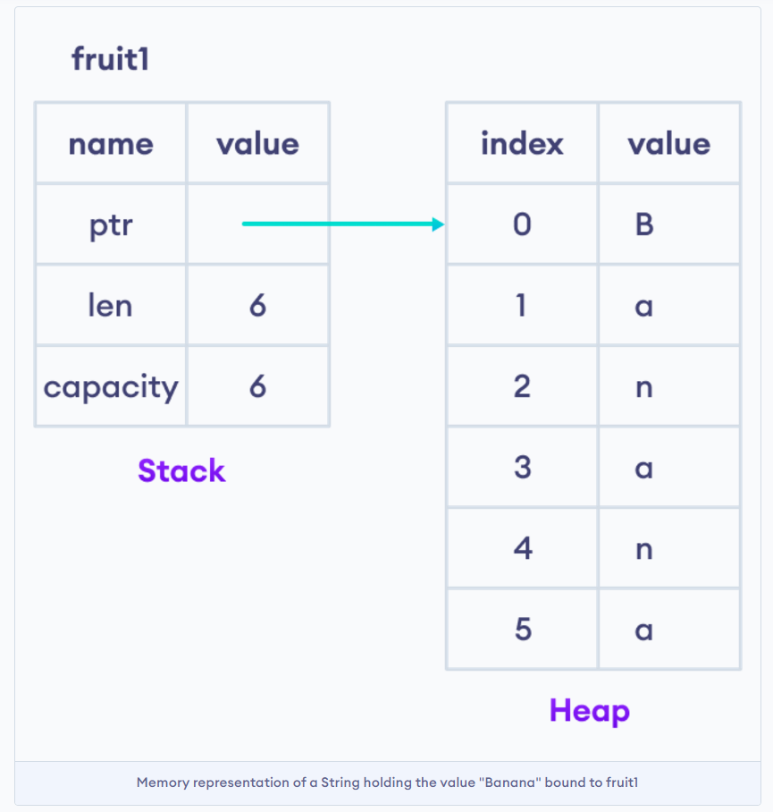
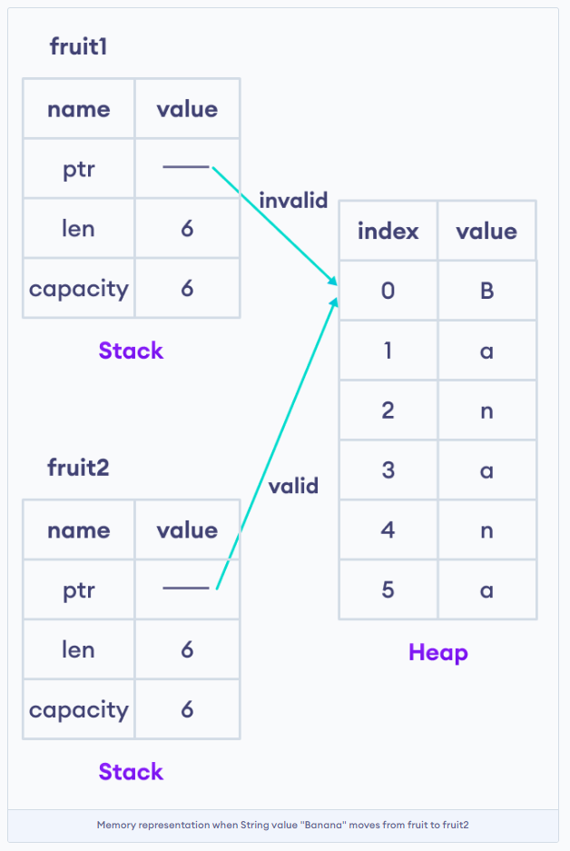

# [Onwership](https://www.programiz.com/rust/ownership)

Rust Ownership
Ownership is a set of rules that ensure memory safety in Rust programs.

Rust has an ownership model for memory management instead of garbage collector and manual memory management.

This ownership makes Rust different from other languages and allows programs to run without memory leaks and slowness.

Variable Scope in Rust
A scope is a code block within the program for which a variable is valid. The scope of a variable defines its ownership.

For example,

```bash
// `name` is invalid and cannot be used here because it's not yet declared
{ // code block starts here
    let name = String::from("Ram Nepali");   // `name` is valid from this point forward
    
    // do stuff with `name`
} // code block ends
// this scope ends, `name` is no longer valid and cannot be used

```

Here the variable name is only available inside the code block, i.e., between the curly braces {}. We cannot use the name variable outside the closing curly brace.

Whenever a variable goes out of scope, its memory is freed.

To learn more about variable scope in Rust, visit [Rust Variable Scope](https://www.programiz.com/rust/variable-scope).

____

Ownership Rules in Rust

Rust has some ownership rules. Keep these rules in mind as we work through some examples:

1. Each value in Rust has an owner.

2. There can only be one owner at a time.

3. When the owner goes out of scope, the value will be dropped.

____

### Data Move in Rust

Sometimes, we might not want a variable to be dropped at the end of the scope. Instead, we want to transfer ownership of an item from one binding (variable) to another.

Here's an example to understand data movement and ownership rules in Rust.

```rust
fn main() {
    // owner of the String value
    // rule no. 1 
    let fruit1 = String::from("Banana");
    
    // ownership moves to another variable
    // only one owner at a time
    // rule no. 2
    let fruit2 = fruit1;
    
    // cannot print variable fruit1 because ownership has moved
    // error, out of scope, value is dropped
    // rule no. 3
    // println!("fruit1 = {}", fruit1);
    
    // print value of fruit2 on the screen
    println!("fruit2 = {}", fruit2);
}
```

#### Output

```bash
fruit2 = Banana
```

Let's look into this example in detail, especially these two lines of code:

```bash
let fruit1 = String::from("Banana");
let fruit2 = fruit1;
```

Here, fruit1 is the owner of the String.

A String stores data both on the stack and the heap. This means that when we bind a String to a variable fruit1, the memory representation looks like this:



A String holds a pointer to the memory that holds the content of the string, a length, and a capacity in the stack. The heap on the right hand side of the diagram holds the contents of the String.

Now, when we assign fruit1 to fruit2, this is how the memory representation looks like:



Rust will invalidate (drop) the first variable fruit1, and move the value to another variable fruit2. This way two variables cannot point to the same content. At any point, there is only one owner of the value.

##### Note: 

The above concept is applicable for data types that don't have fixed sizes in memory and use the heap memory to store the contents.

### Create a copy instead of the move using clone()

```rust
If you want to create a copy rather than move, you can use the clone() method. For example,

fn main() {
    // create a new String.
    let fruit1 = String::from("Banana");
    
    // create a copy of fruit1 using the clone method.
    let fruit2 = fruit1.clone();
    

    println!("fruit1 = {}", fruit1);
    
    // print value of fruit2 on the screen
    println!("fruit2 = {}", fruit2);
}
```

#### Output

```bash
Note: Using clone() can incur additional runtime cost, so it should be used sensibly.
```

____

### Data Copy in Rust

Primitive types (Integers, Floats, and Booleans) have a known size at compile time and are stored entirely on the stack. Due to this, primitive types are cheap to copy, and they implement the copy trait instead of the move.

Let's see an example.

```rust
fn main() {
    let x = 11;
    
    // copies data from x to y 
    let y = x;

    println!("x = {}, y = {}", x, y);
}
```

Here x is copied instead of a move, because primitive types like integers, floats implement the Copy trait by default and hence are copied.

Here, x variable can be used afterward, because x is copied and not moved even though y is assigned to x.

A trait is a way to define shared behavior in Rust. To learn more about traits, visit [Rust Trait](https://www.programiz.com/rust/trait).


