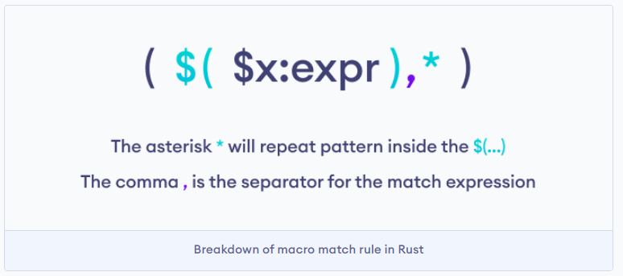

# [Rust Crate and Package](https://www.programiz.com/rust/crate-and-package)

A crate can contain one or more Rust modules, which in turn can contain code, such as functions, types, and constants.

A crate is of two types:

Binary crate
Library crate
A binary crate is a Rust program that compiles to an executable or multiple executables and has a main() function for each executable.

A library crate doesn't compile to an executable and doesn't have a main() function. A library crate generally defines a shared functionality that can be used in multiple projects.

Crates can be bundled together into a package.

____

## Creating a Package in Rust

Packages can be created using the Cargo package manager, which is built into Rust. Cargo comes pre-installed with Rust.

We can use cargo to create a package. A package contains one or more crates that provides a set of functionality.

Note: A package can contain many binary crates, but at most only one library crate.

Creating a Binary Package in Rust

To create a binary package, we can use the cargo command in the terminal.

____

### Aside: Note:

```bash
cd programiz/attempt-01
```

____

```bash
cargo new hello_world --bin
```

### Output

```bash
    Creating binary (application) `hello_world` package
note: see more `Cargo.toml` keys and their definitions at https://doc.rust-lang.org/cargo/reference/manifest.html
```

We create a binary package hello_world using cargo and the --bin option. It is the default cargo behavior.

Let's look at the contents of the hello_world package.

____

### Aside on tree

____

[how to display tree in powershell on windows - Google Search](https://www.google.com/search?q=how+to+display+tree+in+powershell+on+windows&num=10&newwindow=1&sca_esv=6afdee832c06e966&sxsrf=ADLYWIJMjTiT7VLcs5xLfzfuhkx1TKQG_A%3A1730630448662&ei=MFMnZ7uOKIKvhbIPrbG1uA0&ved=0ahUKEwi75oTp_L-JAxWCV0EAHa1YDdcQ4dUDCA8&uact=5&oq=how+to+display+tree+in+powershell+on+windows&gs_lp=Egxnd3Mtd2l6LXNlcnAiLGhvdyB0byBkaXNwbGF5IHRyZWUgaW4gcG93ZXJzaGVsbCBvbiB3aW5kb3dzMggQIRigARjDBDIIECEYoAEYwwQyCBAhGKABGMMESMccUIIQWM8bcAB4A5ABAJgBWqABvAWqAQIxMbgBA8gBAPgBAZgCDaAC5AXCAgQQABhHwgIKECEYoAEYwwQYCpgDAOIDBRIBMSBAiAYBkAYIkgcCMTOgB8BA&sclient=gws-wiz-serp)

[How to use the tree command in PowerShell?](https://www.tutorialspoint.com/how-to-use-the-tree-command-in-powershell#:~:text=c%3A%5C%3Etree%20%2F%3F,ASCII%20instead%20of%20extended%20characters.)

____

#### Aside on tree limit depth

[tree how to only go to depth 3 folders - Google Search](https://www.google.com/search?q=tree+how+to+only+go+to+depth+3+folders&oq=tree+how+to+only+go+to+depth+3+folders&gs_lcrp=EgZjaHJvbWUyBggAEEUYOTIHCAEQIRigAdIBCTExNzEwajBqN6gCALACAA&sourceid=chrome&ie=UTF-8)

____

```bash
ls */*
```

[directory - Can I use ls -R to show up to 2 folder depth? - Ask Ubuntu](https://askubuntu.com/questions/161442/can-i-use-ls-r-to-show-up-to-2-folder-depth)


____

[tree how to only go to depth 3 folders - Google Search](https://www.google.com/search?q=tree+how+to+only+go+to+depth+3+folders&oq=tree+how+to+only+go+to+depth+3+folders&gs_lcrp=EgZjaHJvbWUyBggAEEUYOTIHCAEQIRigAdIBCTExNzEwajBqN6gCALACAA&sourceid=chrome&ie=UTF-8)

###### PowerShell

```bash
Get-Childitem C:\Users\specifyUsername -include *.docx -depth 2
```

[PowerTip: Limit Get-Childitem to a limited depth in the tree - Scripting Blog [archived]](https://devblogs.microsoft.com/scripting/powertip-limit-get-childitem-to-a-limited-depth-in-the-tree/)

____

### End of Aside on tree

### application to current project

to apply this to PowerShell:

Open PowerShell

###### PowerShell

```bash
ls
```

```bash
cd programiz/attempt-01/hello_world
```

```bash
pwd
```

Copy path

Paste to replace insertpath here:

```bash
Get-Childitem insertpath -depth 2
```

###### Output

in \hello_world:

src
Cargo.toml

in \hello_world\src :

main.rs

Corresponds with programiz tutorial

____

Here,

- `hello_world` is the package directory

- `Cargo.toml` is a file that contains metadata about the crate, such as its name, version, and dependencies

- `src/main.rs` is the crate root and contains the source code of the binary package

____

### Creating a Library Package in Rust

____

#### Aside

In git bash

```bash
cd programiz/attempt-01/hello_world
```

#### End Aside

Similarly, we can create a library package in Rust using cargo.

```bash
cargo new hello_world_lib --lib
```

#### Aside


##### Input and Output

```bash
cargo new hello_world_lib --lib
    Creating library `hello_world_lib` package
note: see more `Cargo.toml` keys and their definitions at https://doc.rust-lang.org/cargo/reference/manifest.html
```

Corresponds with the following Screenshot from tutorial



#### End Aside

We create a library package `hello_world_lib` using cargo and the `--lib` option.

Let's look at the contents of the `hello_world_lib` package.

#### Aside

##### cargoBox


#### End Aside

#### Aside

Open PowerShell

###### PowerShell

```bash
ls
```

```bash
cd programiz/attempt-01/hello_world
```

```bash
pwd
```

Copy path

Paste to replace insertpath here:

```bash
Get-Childitem insertpath -depth 2
```

#### End Aside

#### Aside

Open PowerShell

###### PowerShell

```bash
ls
```

```bash
cd programiz/attempt-01/hello_world/hello_world_lib
```

```bash
pwd
```

Copy path

Paste to replace insertpath here:

```bash
Get-Childitem insertpath -depth 2
```

##### Output

###### hello_world\hello_world_lib

src

Cargo.toml

###### hello_world\hello_world_lib\src

lib.rs

#### End Aside

Here,

- `hello_world_lib` is the package directory

- `Cargo.toml` is a file that contains metadata about the crate, such as its name, version, and dependencies

- `src/lib.rs` is the crate root and contains the source code of the library package

A package can contain `src/main.rs` and `src/lib.rs`. In this case, it has two crates: a binary and a library, both with the same name as the package. For example,


____

**Note:** Cargo by convention passes the crate root files to the Rust compiler to build the library or binary.

____
____

## References

### cargoBox image

Google [cargo box ship wooden cartoon old](https://www.google.com/search?q=cargo+box+ship+wooden+cartoon+old&oq=cargo+box+ship+wooden+cartoon+old&gs_lcrp=EgZjaHJvbWUyBggAEEUYOTIHCAEQIRigATIHCAIQIRigAdIBCDg0OTVqMGo3qAIAsAIA&sourceid=chrome&ie=UTF-8)

image made in Google Slides

### Referencing tools

#### Referencing tool

[CoderSales/javascript-chrome-extension-2-version-2: javascript-chrome-extension-2-version-2](https://github.com/CoderSales/javascript-chrome-extension-2-version-2)

____
