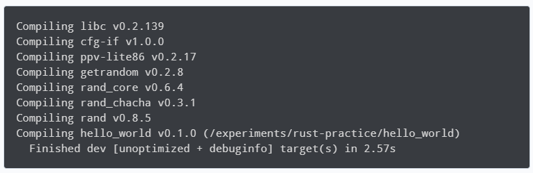

# [Generics](https://www.programiz.com/rust/generics)

Generics allows us to write code that is flexible and can be reused with different types of data, without having to write separate implementations for each type. It helps us write code that can handle values of any type in a type-safe and efficient way.

With the help of generics, we can define placeholder types for our methods, functions, structs, enums and traits.

____

## Using Generics in Rust

We can understand generics by taking a look at [Rust Hashmap](https://www.programiz.com/rust/hashmap).

HashMap uses generics which allows creation of reusable and efficient code, as a single implementation that works with different types.

A Rust HashMap has two generic types, one for the key and the second for the value.

A HashMap type looks like this:

```rust
HashMap<K, V>
```

where <K, V>: K is the type of the key and V is the type of the value.

Now, when we create a HashMap we can set any type to K and V.

```rust
let mut numbers: HashMap<i32, &str> = HashMap::new();
```

Here, the angle bracket <i32, &str> notation denotes the type of key and type of value of the HashMap. The type of the key K is i32 and the type of the value V is &str.

Similarly, we create a HashMap and set the type of both key and value to &str.

```rust
let mut language_codes: HashMap<&str, &str> = HashMap::new();
```

Using generics to define the type of HashMap helps us work with numerous arbitrary types available in Rust.

To know the basics of HashMap, visit [Rust HashMap](https://www.programiz.com/rust/hashmap).

**Note:**

- Generics or generic types use a single character like K, V, T, U to distinguish from actual concrete types like String, &str, i32.

- As a convention,

    - T, U are used for arbitrary types

    - K, V are used for key-value types

    - E is used for error type

____

### Example: Using Generics in Rust

```rust
use std::collections::HashMap;

fn main() {
    // Create a HashMap with types i32 and &str
    let mut numbers: HashMap<i32, &str> = HashMap::new();

    // Insert values to numbers HashMap
    numbers.insert(1, "One");
    numbers.insert(2, "Two");

    println!("Numbers: {:?}", numbers);
    
    // Create a HashMap with types &str and &str   
    let mut language_codes: HashMap<&str, &str> = HashMap::new();

    // Insert values to language_codes HashMap
    language_codes.insert("EN", "English");
    language_codes.insert("NE", "Nepali");
    
    println!("Language Codes: {:?}", language_codes);
}
```

#### Output

##### Tutorial Screenshot



#### Commands

```bash
cargo build
```

```bash
cargo run
```

##### Output from code

```bash
Numbers: {2: "Two", 1: "One"}
Language Codes: {"EN": "English", "NE": "Nepali"}
```

Here, we create two HashMap data structures: `HashMap<i32, &str>` and `HashMap<&str, &str>`.

This is possible because HashMap implementation uses generics and can work with different types.

____

### Generic Struct

We can create a generic struct data structure in Rust with the help of generics. For example, we can declare a struct with generic parameter(s).

```rust
struct Point<T> {
    x: T,
    y: T,
}
```

Here, we create a struct `Point` with generic type parameter `T` in angle brackets. Inside the body of the struct, we use the `T` data type for `x` and `y`.

Now, to use the generic struct `Point` we can initialize it and bind it to a variable.

```rust
let int_point = Point { x: 1, y: 2 };
let float_point = Point { x: 1.1, y: 2.2 };
```

Here, we initialize the `Point` struct twice, first with integer values and second with float values.

____

#### Example: Generic Struct in Rust

```rust
fn main() {
    // defining a struct with generic data type
    #[derive(Debug)]
    struct Point<T> {
        x: T,
        y: T,
    }
    
    // initializing a generic struct with i32 data type
    let int_point = Point { x: 1, y: 2 };
    
    // initializing a generic struct with f32 data type
    let float_point = Point { x: 1.1, y: 2.2 };
    
    println!("int_point: {:?}", int_point);
    println!("float_point: {:?}", float_point);
}
```

##### Output

###### from programiz Tutorial

```bash
int_point: Point { x: 1, y: 2 }
float_point: Point { x: 1.1, y: 2.2 }
```

###### Commands to compile and run program

```bash
cargo build
```

###### Compiler

```bash
warning: fields `x` and `y` are never read
 --> src/main.rs:5:9
  |
4 |     struct Point<T> {
  |            ----- fields in this struct
5 |         x: T,
  |         ^
6 |         y: T,
  |         ^
  |
  = note: `Point` has a derived impl for the trait `Debug`, but this is intentionally ignored during dead code analysis
  = note: `#[warn(dead_code)]` on by default

warning: `hello_world` (bin "hello_world") generated 1 warning
    Finished `dev` profile [unoptimized + debuginfo] target(s) in 0.23s
```

###### Run

```bash
cargo run
```

###### Messages when running

```bash
warning: fields `x` and `y` are never read
 --> src/main.rs:5:9
  |
4 |     struct Point<T> {
  |            ----- fields in this struct
5 |         x: T,
  |         ^
6 |         y: T,
  |         ^
  |
  = note: `Point` has a derived impl for the trait `Debug`, but this is intentionally ignored during dead code analysis
  = note: `#[warn(dead_code)]` on by default

warning: `hello_world` (bin "hello_world") generated 1 warning
    Finished `dev` profile [unoptimized + debuginfo] target(s) in 0.02s
```

###### Output from code

```bash
int_point: Point { x: 1, y: 2 }
float_point: Point { x: 1.1, y: 2.2 }
```
